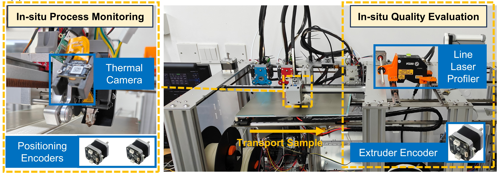

# 基于多源传感器的原位监测FDM平台
 本篇面向CodeFab成员
<!-- PROJECT LOGO -->
<br />
<p align="center">
    
  </a>

  <h3 align="center">具备原位检测功能的FDM科研平台</h3>
  <p align="center">
    目前集成热成像相机、2D线激光相机以及编码器
    <br />
      <a><strong>原位测量几何信息、温度场以及喷嘴状态</strong></a>
    <br />    
    <br />
      <a href="https://github.com/shaojintian/Best_README_template">2D线激光相机</a>
      ・
      <a href="https://github.com/shaojintian/Best_README_template/issues">热成像相机</a>
      ・
      <a href="https://github.com/shaojintian/Best_README_template/issues">编码器</a>
    </p>
  </p>

</p>


 
## 目录

- [基于多源传感器的原位监测FDM平台](#基于多源传感器的原位监测fdm平台)
  - [目录](#目录)
    - [上手指南](#上手指南)
          - [开发前的配置要求](#开发前的配置要求)
          - [安装步骤](#安装步骤)
    - [文件目录说明](#文件目录说明)
    - [版本控制](#版本控制)
    - [作者](#作者)

### 上手指南

###### 开发前的配置要求

1. VS2017 
2. Python 3.8
3. espidf 4.4

###### 安装步骤
```sh
git clone https://github.com/shaojintian/Best_README_template.git
```

### 文件目录说明
eg:
```
filetree 
├── README.md
├── /img/                 #展示图片
├── /doc/                 #传感器相关文档
├── /project/
│  ├── /2D_line_laser/    #线激光相关
│  │  ├── /app/           #应用层
|  |  |── /driver/        #驱动层
│  │  └── README.md
│  ├── /Encoder/          #编码器相关
│  │  ├── /app/           #应用层
|  |  |── /driver/        #驱动层
|  |  |── /example/       #应用事例
│  │  └── README.md
│  ├── /Thermal Camera/   #热成像相关
│  │  ├── /app/           #应用层
|  |  |── /driver/        #驱动层
│  │  └── README.md
├── /include/             #常用函数库
│  ├── /MyFunc/  
│  │  ├── my_csv.py       #表格操作相关函数
│  │  ├── my_cv2.py       #图像处理相关函数
│  │  ├── my_gcode.py     #G代码操作相关函数
│  │  ├── my_math.py      #数学相关函数
│  │  ├── my_open3D.py    #点云操作相关函数
│  │  ├── my_plot.py      #绘图操作相关函数
└── README.md
```

### 版本控制

该项目使用Git进行版本管理。您可以在repository参看当前可用版本。

### 作者

495590704@qq.com


<!-- links -->
[your-project-path]:shaojintian/Best_README_template
[contributors-shield]: https://img.shields.io/github/contributors/shaojintian/Best_README_template.svg?style=flat-square
[contributors-url]: https://github.com/shaojintian/Best_README_template/graphs/contributors
[forks-shield]: https://img.shields.io/github/forks/shaojintian/Best_README_template.svg?style=flat-square
[forks-url]: https://github.com/shaojintian/Best_README_template/network/members
[stars-shield]: https://img.shields.io/github/stars/shaojintian/Best_README_template.svg?style=flat-square
[stars-url]: https://github.com/shaojintian/Best_README_template/stargazers
[issues-shield]: https://img.shields.io/github/issues/shaojintian/Best_README_template.svg?style=flat-square
[issues-url]: https://img.shields.io/github/issues/shaojintian/Best_README_template.svg
[license-shield]: https://img.shields.io/github/license/shaojintian/Best_README_template.svg?style=flat-square
[license-url]: https://github.com/shaojintian/Best_README_template/blob/master/LICENSE.txt
[linkedin-shield]: https://img.shields.io/badge/-LinkedIn-black.svg?style=flat-square&logo=linkedin&colorB=555
[linkedin-url]: https://linkedin.com/in/shaojintian


