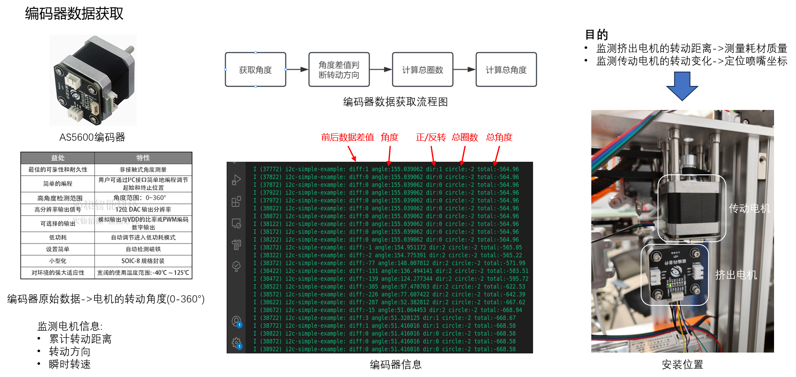
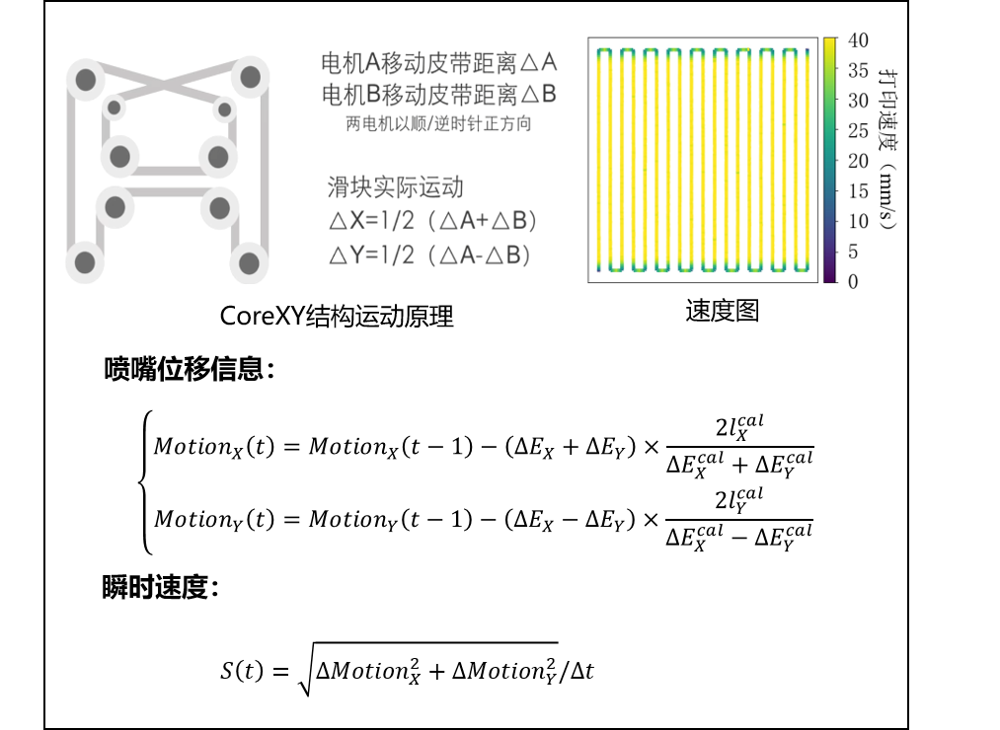

# 编码器监测开发
 本篇面向CodeFab成员
<!-- PROJECT LOGO -->
 

    
  </a>
  
  <h3 align="center" >耗材质量测量</h3>
  

    监测挤出机电机转动进程，记录实时耗材质量
     
    <a href="https://github.com/shaojintian/Best_README_template"><strong>demo ?</strong></a>
      
  

  <h3 align="center" >喷嘴位置测量</h3>
  

    监测传动电机转动进程，记录实时喷嘴位置
     
    <a href="https://github.com/shaojintian/Best_README_template"><strong>demo ?</strong></a>
      
  

 
## 目录

- [编码器监测开发](#编码器监测开发)
  - [目录](#目录)
    - [上手指南](#上手指南)
          - [开发前的配置要求](#开发前的配置要求)
    - [耗材质量测量](#耗材质量测量)
    - [喷嘴位置测量](#喷嘴位置测量)
    - [版本控制](#版本控制)
    - [作者](#作者)

### 上手指南
本项目根据[AS5600编码器数据手册](https://github.com/zzw495590704/MasterDegreeProject/tree/main/doc)进行开发
###### 开发前的配置要求
1. ESP32单片机环境：espidf 4.4 

### 耗材质量测量
通过将挤出机转动进程与实际耗材质量进行标定，测量实时耗材质量

### 喷嘴位置测量
XY轴传动电机与喷嘴位移距离的标定，标定完成后实现喷嘴位移的实时监测。

### 版本控制

该项目使用Git进行版本管理。您可以在repository参看当前可用版本。

### 作者

495590704@qq.com

<!-- links -->
[your-project-path]:shaojintian/Best_README_template
[contributors-shield]: https://img.shields.io/github/contributors/shaojintian/Best_README_template.svg?style=flat-square
[contributors-url]: https://github.com/shaojintian/Best_README_template/graphs/contributors
[forks-shield]: https://img.shields.io/github/forks/shaojintian/Best_README_template.svg?style=flat-square
[forks-url]: https://github.com/shaojintian/Best_README_template/network/members
[stars-shield]: https://img.shields.io/github/stars/shaojintian/Best_README_template.svg?style=flat-square
[stars-url]: https://github.com/shaojintian/Best_README_template/stargazers
[issues-shield]: https://img.shields.io/github/issues/shaojintian/Best_README_template.svg?style=flat-square
[issues-url]: https://img.shields.io/github/issues/shaojintian/Best_README_template.svg
[license-shield]: https://img.shields.io/github/license/shaojintian/Best_README_template.svg?style=flat-square
[license-url]: https://github.com/shaojintian/Best_README_template/blob/master/LICENSE.txt
[linkedin-shield]: https://img.shields.io/badge/-LinkedIn-black.svg?style=flat-square&logo=linkedin&colorB=555
[linkedin-url]: https://linkedin.com/in/shaojintian

