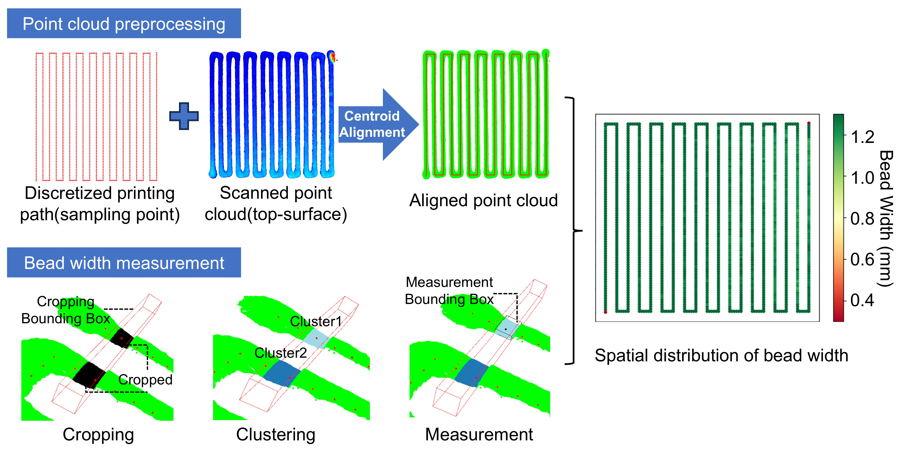

# 2D线激光传感器开发
 本篇面向CodeFab成员
<!-- PROJECT LOGO -->
 

    
  </a>
  
  <h3 align="center">挤出机编码器测量样件重量</h3>
  

    监测挤出机电机转动进程，记录实时耗材质量
     
    <a><strong></strong></a>
         
  

 
## 目录

- [2D线激光传感器开发](#2d线激光传感器开发)
  - [目录](#目录)
    - [上手指南](#上手指南)
          - [开发前的配置要求](#开发前的配置要求)
    - [驱动层](#驱动层)
      - [触发扫描程序](#触发扫描程序)
    - [应用层](#应用层)
      - [几何信息测量](#几何信息测量)
      - [道宽分布测量](#道宽分布测量)
      - [高通量数据采集](#高通量数据采集)
    - [版本控制](#版本控制)
    - [作者](#作者)

### 上手指南
本项目根据2D线激光相机的SDK进行开发
###### 开发前的配置要求
1. VS2017 
2. PCL 1.4

### 驱动层
#### 触发扫描程序
通过监测平台移动速度与扫描速度匹配触发线激光采样

### 应用层
#### 几何信息测量
测量样件点云体积、粗糙度、均值高度和平面高度信息

#### 道宽分布测量
微分法测量样件道宽分布

#### 高通量数据采集
自动化测量每版样件的信息，实现高通量数据获取

### 版本控制

该项目使用Git进行版本管理。您可以在repository参看当前可用版本。

### 作者

495590704@qq.com

<!-- links -->
[your-project-path]:shaojintian/Best_README_template
[contributors-shield]: https://img.shields.io/github/contributors/shaojintian/Best_README_template.svg?style=flat-square
[contributors-url]: https://github.com/shaojintian/Best_README_template/graphs/contributors
[forks-shield]: https://img.shields.io/github/forks/shaojintian/Best_README_template.svg?style=flat-square
[forks-url]: https://github.com/shaojintian/Best_README_template/network/members
[stars-shield]: https://img.shields.io/github/stars/shaojintian/Best_README_template.svg?style=flat-square
[stars-url]: https://github.com/shaojintian/Best_README_template/stargazers
[issues-shield]: https://img.shields.io/github/issues/shaojintian/Best_README_template.svg?style=flat-square
[issues-url]: https://img.shields.io/github/issues/shaojintian/Best_README_template.svg
[license-shield]: https://img.shields.io/github/license/shaojintian/Best_README_template.svg?style=flat-square
[license-url]: https://github.com/shaojintian/Best_README_template/blob/master/LICENSE.txt
[linkedin-shield]: https://img.shields.io/badge/-LinkedIn-black.svg?style=flat-square&logo=linkedin&colorB=555
[linkedin-url]: https://linkedin.com/in/shaojintian

