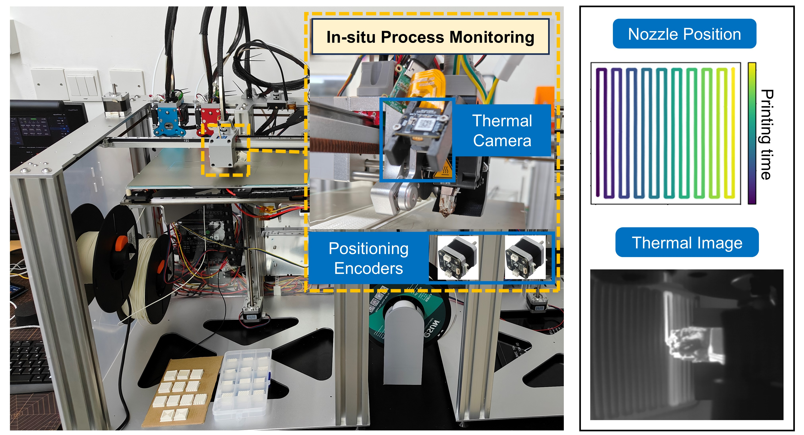
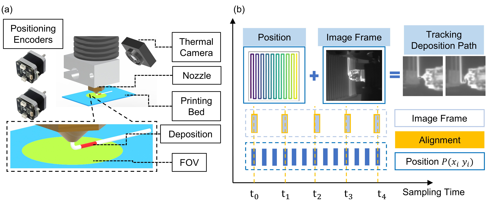
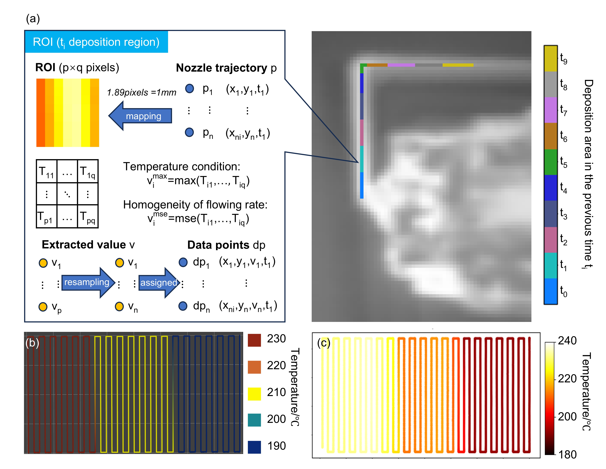

# 热成像相机开发
 本篇面向CodeFab成员
<!-- PROJECT LOGO -->
 

    
  </a>
  
  <h3 align="center">喷嘴集成热成像传感器监测瞬时沉积温度场</h3>
  

    喷嘴空间信息与热成像结合，记录实时监测喷嘴挤出温度场
     
    <a><strong></strong></a>
         
  

 
## 目录

- [热成像相机开发](#热成像相机开发)
  - [目录](#目录)
    - [上手指南](#上手指南)
          - [开发前的配置要求](#开发前的配置要求)
    - [驱动层](#驱动层)
      - [数据采集](#数据采集)
    - [应用层](#应用层)
      - [温度场测量](#温度场测量)
    - [版本控制](#版本控制)
    - [作者](#作者)

### 上手指南
本项目根据[热成像传感器SDK](https://github.com/zzw495590704/MasterDegreeProject/tree/main/doc)进行开发
###### 开发前的配置要求
1. VS2017 
2. ASIC_2121W_win&&linux_SDK_V1.5.3

### 驱动层
#### 数据采集
以周期脉冲作为时间，同时记录热成像数据和喷嘴位置信息，完成数据采集

### 应用层
#### 温度场测量
根据数据提取时空融合的温度场信息

### 版本控制

该项目使用Git进行版本管理。您可以在repository参看当前可用版本。

### 作者

495590704@qq.com

<!-- links -->
[your-project-path]:shaojintian/Best_README_template
[contributors-shield]: https://img.shields.io/github/contributors/shaojintian/Best_README_template.svg?style=flat-square
[contributors-url]: https://github.com/shaojintian/Best_README_template/graphs/contributors
[forks-shield]: https://img.shields.io/github/forks/shaojintian/Best_README_template.svg?style=flat-square
[forks-url]: https://github.com/shaojintian/Best_README_template/network/members
[stars-shield]: https://img.shields.io/github/stars/shaojintian/Best_README_template.svg?style=flat-square
[stars-url]: https://github.com/shaojintian/Best_README_template/stargazers
[issues-shield]: https://img.shields.io/github/issues/shaojintian/Best_README_template.svg?style=flat-square
[issues-url]: https://img.shields.io/github/issues/shaojintian/Best_README_template.svg
[license-shield]: https://img.shields.io/github/license/shaojintian/Best_README_template.svg?style=flat-square
[license-url]: https://github.com/shaojintian/Best_README_template/blob/master/LICENSE.txt
[linkedin-shield]: https://img.shields.io/badge/-LinkedIn-black.svg?style=flat-square&logo=linkedin&colorB=555
[linkedin-url]: https://linkedin.com/in/shaojintian

